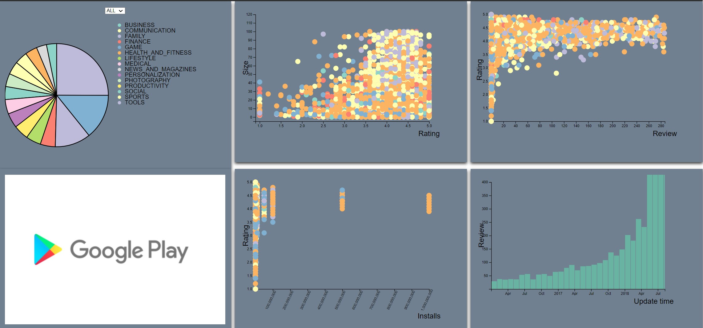

# Data-Vis-Final-Project

The we use the  google play store data set to present it.
# Introduction
Google Play
* Also known as the Google Play Store
* Over 82 billion app downloads in 2016、Over 3.5 million apps published in 2017

In this dataset, each app has values for 
1. Category : Games、Sports…
2. Rating : 5-point scale
3. Size : Size of the app
4. Price : Price of the app
5. Last updated : Date when the app was last updated on Play Store

# How to use it
1. Host main.html as webpage.
2. Use mouse cursor on pie chart, scatter plot, histogram to see tooltip.
3. Use the mouse cursor on the pie chart to view the animation.
4. Click the menu in the upper left corner to choose to display paid or free apps
5. Click the application type on the pie chart to see the changes in the scatter plots and histograms on the right side of the page.
6. Use the mouse cursor on the histogram  to see the number of comments at a specific time.
